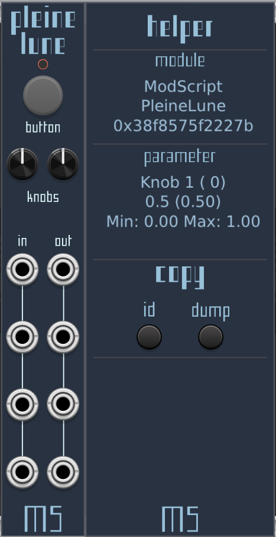

# ModScript
### Modular Scripting

Scripting in VCV Rack for better integration with your patch and designed for use with MIDI controllers!

## _Lune & Pleine Lune_
### Lua scripting in VCV Rack
In Lune, you can control arbitrary parameters from any module in the patch.  
The accompanying "Lune Helper" module helps with finding the info you need to write scripts for the patch you are working on.  

ModScript's approach differs from the usual "everything-is-a-module" paradigm: it allows you to write all the MIDI interaction you need using code that is easy to read and write and to remain focused on musical elements in the patch.  



Interested? Please [join the conversation](https://community.vcvrack.com/t/modscript-using-scripts-for-a-better-and-richer-integration-with-midi-controllers-beta-soon/18197) on VCV Rack forum!

#### Features:
- 2 variations, Lune & Pleine Lune, the latter adds MIDI i/o
- Complete MIDI support, 2 and 3 bytes messages, send SysEX, sysEX receive is upcoming shortly!
- 4 i/o, 2 knobs, 1 button, 1 RGB led
- Read, write parameters in various ways, read lights value
- Lune auto-reloads the script when it changes
- Modules and parameters referenced by ids, easily found using Lune Helper
- The context menu lists the lua files found in the `scripts/` folder
- The context menu shows and allows to copy the last hovered module's id to the clipboard. Also shows last hovered parameter id.  
- Parameters modified from the script will briefly show a little indicator (eg. like when mapped in MIDIMap) to make the script's action more visually obvious
- Add and remove cables from the script (experimental)
- Library of useful functions (MIDI message type, inspection) and objects (trigger, boolean trigger, pulse generator) and known modules.
- Insanely fast LuaJIT engine, forked from VCV Prototype

#### Expected super cool usecases:
- Integrating MIDI controllers with modules
- Advanced controller usage: stateful, led feedback, modifier keys (Shift etc.), screens, relative knobs, ~~read~~(soon!) and write SysEX to device
- Scripting in headless mode can be wooow!

## Videos

https://synthe.tiseur.fr/userfiles/videos/lune/lune3.mp4

See also [this video](https://synthe.tiseur.fr/userfiles/videos/lune/lune1.mp4) and [this one for a bit of live coding!](https://synthe.tiseur.fr/userfiles/videos/lune/lune2_3.mp4) ([resulting script](/scripts/apcmini.lua))

## Example and API demo
### Modules
```lua
mymodule = Module(0xdeadbeef12345) -- a module is identified by its ID

myVCO = NewVCO(0x123456789) -- known modules made from the helper's dump

mymodule.params = { -- optionally, a map of names to ids can be defined for the parameters
	["freq"] = {index = 0},
	["res"] = {index = 1}
}
```

### Parameters
```lua
-- afterwards in process...
-- by default parameters are normalized to 0.0-1.0
mymodule:setParam("freq", 0,3) -- the module and name can be used to set parameters
mymodule:setParam(12, 0.98) -- or an arbitrary parameter id

 -- use Raw to set exact value (use the Helper to find the correct values)
mymodule:setParamRaw("waveform", 4.0)
-- relative mode to increment or decrement parameter from its current value - useful for relative knobs!
mymodule:setParamRelative("cutoff", 0.05)

-- do not show red indicator, useful if you set many parameters rapidly and often
mymodule:setParamNoIndicator("obscureparam", 0.0)

__setParamValue(0x12acab345abc, 3, 1.0) -- or you can even use any module and parameter id using the low-level call

-- retrieve parameter value
myVCO:getParam("dry_level")
-- and light value
myVCO:getLight(17) -- unfortunately lights aren't named most of the time and multi-color lights have one index for each color, eg. an RGB light will span accross 3 indices
-- it is recommended to get a dump of the module or even read the source code if available for a better understanding of the module's lights
```

### MIDI
```lua
-- handling is done in process(), see scripts/example.lua, details in scripts/lib/lib.lua

-- Easy to use table generated using the Message() function
msg = Message(block.midiInput[i])
display('type ' .. string.format("0x%x", msg.type) .. ' channel ' .. msg.channel .. ' note ' .. msg.note .. ' value ' .. msg.value)
display(status(msg)) -- get the message type as a string

-- sending
sendMidiMessage(NOTE_ON, 64, 64)
sendMidiMessage(NOTE_OFF, 64, 64)

-- SysEX
sendSysex(bytes)
-- utility function to include text in sysex at designated offset with padding
writeString(buffer, start_offset, "text string", pad_to_offset) -- buffer is modified in-place
```

### Cables (experimental, not tested recently)
```lua
-- Cables, up to 256 cables can be managed from the script
id = addCable(moduleWithOutput, outputId, moduleWithInput, inputId) -- returns an id to use when deleting (not the actual Rack id)
removedCable(id) -- removes cable from the patch, only cables added from the script can be removed
-- Note: cables added from the script that are not removed from the script will not free their slot in the 256 pool
```


### Building
```
make dep
make
```

#### License info
Plugin is licensed under GNU General Public License v3.0 or later (`GPL-3.0-or-later`)  
Panel font is https://velvetyne.fr/fonts/facade/ by Éléonore Fines  

#### Authorship note
> This plugin borrows a lot of code from https://github.com/VCVRack/VCV-Prototype/tree/v2  
> File watching and all engines except LuaJIT have been removed  
> Where appropriate, any other reference to orignal code is included.  
> The repositories linked above contain additional licensing information in LICENSE.md at their root.  