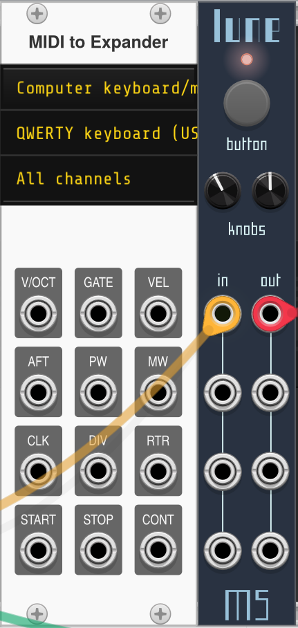
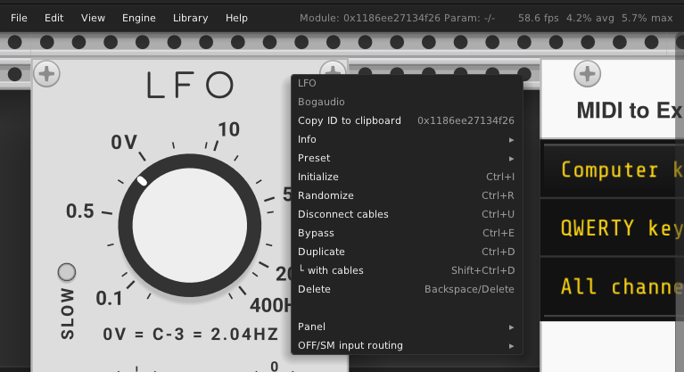

# ModScript
### Modular Scripting

:warning: WIP!  

## _Lune_
### Lua scripting in VCV Rack
What if scripting in VCV Rack really leveraged a more complete API to the Rack application?  
In Lune (moon in french, lua being moon in portugese:), you can control arbitrary parameters from any module in the patch.  
The accompanying "MIDItoExpander" module (a modified version of "MIDI to CV") passes MIDI messages to your script.  

This plugin is also part of a broader dare I say "experiment" on the Rack codebase, how to improve it not only through modules but more importantly looking at how the software itself can be modified to accomodate new or different needs. [See here](#Notes)  

The "everything-is-a-module" paradigm can only go as far as your musicianship will let it clutter its realm with non-musical details.  




#### Features:
- 4 i/o, 2 knobs, 1 button, 1 RGB led
- Lune can auto-reload the script whenever it changes.
- The context menu presents you with a list of the lua files found in the `scripts/` folder
- The context menu shows and allows to copy the last hovered module's id to the clipboard. Also shows last hovered parameter id.  
- Parameters modified from the script will briefly show a little indicator (eg. like when mapped in MIDIMap) to make the script's action more visually obvious
- Add and remove cables from the script. There are some limitations, see example below.

#### Soon to be added:
- MIDI output
- "Pleine Lune", same features but MIDI I/O and Lua in a single module!

#### Expected super cool usecases:
- Integrating MIDI controllers with modules
- Advanced controller usage: stateful, led feedback, modifier keys (Shift etc.)
- Scripting in headless mode can be wooow!

## Example script
```lua
mymodule = Module(0xdeadbeef12345) -- a module is identified by its ID
mymodule.params = { -- optionally, a map of names to ids can be defined for the parameters
	freq = 0,
	res = 1
}
-- afterwards in process...	
setParamValue(mymodule, "freq", 0.3) -- the module and the mapped name can be referenced to set it
setParamValue(mymodule, 12, -0.5) -- or an arbitrary parameter id
__setParamValue(0x123456789ABC, 3, 1.0) -- or even any id using the low-level call

-- MIDI handling, shown in scripts/example.lua, details in scripts/lib/lib.lua
for i=1,block.midiInputSize do
	msg = Message(block.midiInput[i])
	display('type ' .. string.format("0x%x", msg.type) .. ' channel ' .. msg.channel .. ' note ' .. msg.note .. ' value ' .. msg.value)
end

-- Cables, up to 256 cables can be managed from the script
id = addCable(moduleWithOutput, outputId, moduleWithInput, inputId) -- returns an id to use when deleting (not the actual Rack id)
removedCable(id) -- removes cable from the patch, only cables added from the script can be removed
-- Note: cables added from the script that are not removed from the script will not free their slot in the 256 pool
```


### Building
```
make dep
make
```

### Notes
The fork at https://github.com/Simon-L/VxV/tree/vxv-hoverid contains a few commits that add labels to the menu bar and context menu option to ease copying of module's ids which are needed for scripts in Lune.


#### License info
Plugin is licensed under GNU General Public License v3.0 or later (`GPL-3.0-or-later`)  
Panel font is https://velvetyne.fr/fonts/facade/ by Éléonore Fines  
MIDIToExpander based on CC0 panel by Rcomian  

#### Authorship note
> This plugin borrows a lot of code from https://github.com/VCVRack/VCV-Prototype/tree/v2  
> File watching and all engines except LuaJIT have been removed  
> The Midi to CV module is copied from VCV Rack's Core plugin https://github.com/VCVRack/Rack/blob/v2/src/core/MIDI_CV.cpp  
> Where appropriate, any other reference to orignal code is included.  
> The repositories linked above contain additional licensing information in LICENSE.md at their root.  